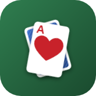
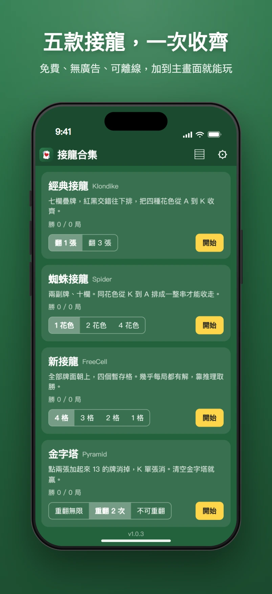
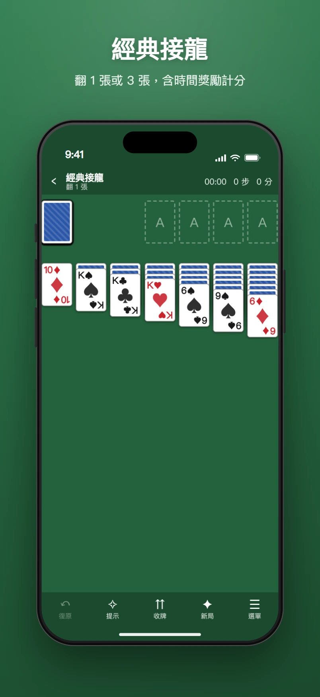
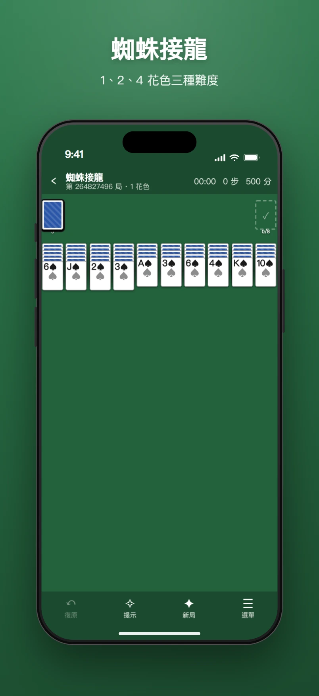
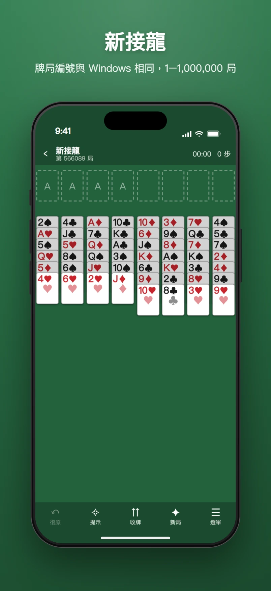
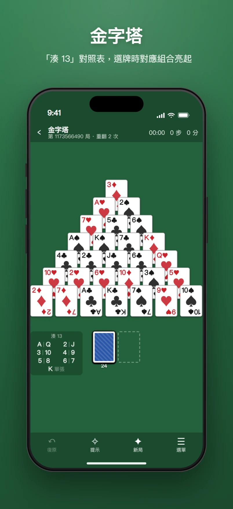
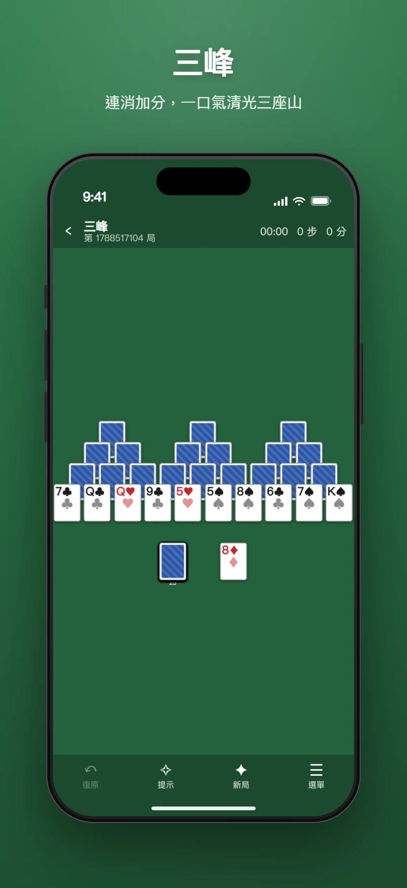
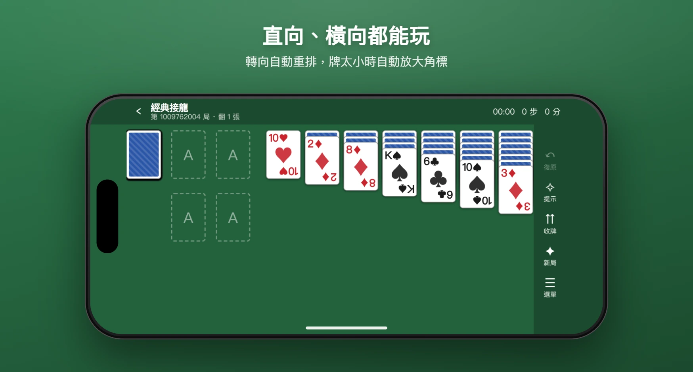

<p align="center">
  
</p>

<h1 align="center">🃏 接龍合集</h1>

<p align="center">
  <a href="CHANGELOG.md"></a>
  <a href="LICENSE"></a>
  <a href="#-安裝到-iphone"></a>
</p>

<p align="center">免費、無廣告、可離線的網頁接龍合集。純 HTML / CSS / JavaScript，零依賴、零建置、零追蹤。<br>加到 iPhone 主畫面後，沒有網路也能玩。</p>

> 🔗 **線上版**：https://muzsor.github.io/solitaire-collection/
>
> 📋 **變更紀錄**：[CHANGELOG.md](CHANGELOG.md)

## 📑 目錄

- [🃏 接龍合集](#-接龍合集)
  - [📑 目錄](#-目錄)
  - [🎮 遊戲與難度](#-遊戲與難度)
  - [📸 截圖](#-截圖)
  - [✨ 功能](#-功能)
  - [📱 安裝到 iPhone](#-安裝到-iphone)
  - [🛠️ 開發](#️-開發)
  - [🔒 隱私](#-隱私)
  - [📄 授權](#-授權)

---

## 🎮 遊戲與難度

| 遊戲 | 難度選項 | 計分 |
|---|---|---|
| ♠️ **經典接龍** Klondike | 翻 1 張 / 翻 3 張 | 有，含時間獎勵 |
| 🕷️ **蜘蛛接龍** Spider | 1 / 2 / 4 花色 | 有 |
| 🔓 **新接龍** FreeCell | 暫存格 4 / 3 / 2 / 1，局號 1–1,000,000 與 Windows 相同 | 計時與步數 |
| 🔺 **金字塔** Pyramid | 重翻牌堆 無限 / 2 次 / 不可 | 有 |
| ⛰️ **三峰** TriPeaks | — | 有，連消加分 |

難度可在首頁卡片或設定頁切換，下一局生效。每一局都有局號，從遊戲選單可以複製或輸入局號，和朋友玩同一副牌。新接龍的局號與 Windows 新接龍相同（1–1,000,000），前 100 萬局中同樣有 8 局無解，最有名的是第 11982 局。

---

## 📸 截圖

首頁與五款遊戲（iPhone 直向），以及轉成橫向後的排版。

<p align="center">
  
  
  
</p>
<p align="center">
  
  
  
</p>
<p align="center">
  
</p>

---

## ✨ 功能

- 👆 拖曳整疊搬動，或點一下自動移到最合理的位置
- 🔦 蜘蛛接龍、新接龍把不成串的牌稍微調暗，一眼看出最上面那串能整疊搬幾張
- ↩️ 無限復原、💡 提示、⏫ 一鍵收牌
- 🔁 長按「復原」或從選單回到這局開頭，同一副牌重來且不算放棄
- 💾 每款各自存檔，切換遊戲或關閉後再開都能繼續，連復原歷史也保留
- 📊 勝場、勝率、最佳時間、最高分、連勝統計
- 🔢 每局都有局號，選單可複製或輸入局號，和朋友玩同一副牌；新接龍局號與 Windows 相同
- 🔄 直向、橫向都可玩，轉向自動重排，牌太小時自動放大角標
- 🎨 慣用手（牌堆放在慣用手那一側，金字塔的湊 13 小表放另一側）、大字模式、桌面與牌背顏色、音效、計時器
- 🧮 金字塔附「湊 13」對照表，選牌時對應組合會亮起
- 📖 每款遊戲都有中文規則說明
- 🚧 無路可走時跳出橫幅，可復原、回到開頭或發新局
- 💾 統計與設定可匯出成一段文字備份，換手機貼回即可還原
- 📱 PWA 離線快取，有新版本時提示更新，不打斷遊戲

---

## 📱 安裝到 iPhone

1. 用 Safari 開線上版網址
2. 點下方「分享」→「加入主畫面」
3. 第一次在有網路時開一次，之後離線也能玩

加入主畫面後是全螢幕、沒有網址列，也不會有 Safari 雙擊放大的問題。

---

## 🛠️ 開發

純前端、零依賴、零建置步驟。

| 檔案 | 用途 |
|---|---|
| `index.html` | 頁面結構 |
| `css/style.css` | 樣式：直橫向排版、牌面、對話框 |
| `js/app.js` | 畫面流程、設定、統計、存檔 |
| `js/engine.js` | 共用引擎：牌堆、移動、復原、動作日誌與重播 |
| `js/render.js` | 牌桌繪製、拖曳、自動排版 |
| `js/games/*.js` | 五款遊戲各自的規則 |
| `js/rules.js` | 中文規則說明 |
| `js/rng.js` | 隨機數與 Microsoft FreeCell 發牌演算法 |
| `sw.js` | Service Worker 離線快取 |
| `version.js` | 版本號，頁面與 Service Worker 共用 |
| `manifest.webmanifest` | PWA 設定 |
| `tests.html` | 單元測試（瀏覽器直接開） |
| `scripts/icons.html` | 圖示產生器（瀏覽器直接開，下載 PNG） |
| `scripts/screenshots.mjs` | 截圖產生器：無頭 Chrome 擷圖並套上 `screenshots-frame.html` 的 iPhone 外框 |
| `docs/screenshots/` | README 用的截圖，由上面的腳本產生 |

<details>
<summary>🚀 本機啟動</summary>

需要 Node.js 18 以上（只用來跑開發伺服器，遊戲本身不需要）。

```bash
npm run dev
# 開 http://localhost:8124/
```

同一個 Wi-Fi 的手機要連進來測試：

```bash
npm run dev:lan
# 終端機會印出手機可用的網址
```

本機模式下 Service Worker 不會快取，改完程式重新整理即可。

</details>

<details>
<summary>🔢 發布新版本</summary>

1. 改 `version.js`：功能有變動就升 `APP_VERSION`，任何部署都把 `APP_BUILD` 加一
2. 在 [CHANGELOG.md](CHANGELOG.md) 記錄變更
3. 推上去後，已安裝的使用者下次開啟會看到「有新版本可用」

`APP_BUILD` 同時決定 Service Worker 的快取名稱與首頁底部顯示的版本，只需要改這一個檔。

</details>

<details>
<summary>💾 存檔格式</summary>

存檔只記「種子、選項、每一步的動作」，重開時用同一個種子重新發牌再重播，所以整局只有幾 KB，復原歷史也完整保留。另存一份最終狀態當校驗：若日後規則改版導致重播結果不同，就直接採用該狀態，只是失去往前復原的能力。

</details>

<details>
<summary>🧪 單元測試</summary>

開 http://localhost:8124/tests.html 就會執行並列出結果，涵蓋：Microsoft 牌局編號、復原與重來、存檔往返、五款遊戲的接牌規則、計分、卡死判定。

</details>

<details>
<summary>🎨 重新產生圖示</summary>

圖示是 `scripts/icons.html` 裡的一段 SVG。改完後用瀏覽器開該頁下載四張 PNG 放回 `icons/`，或用 Chrome 無頭模式：

```bash
chrome --headless=new --default-background-color=00000000 --window-size=512,512 --screenshot=icons/icon-512.png "http://localhost:8124/scripts/icons.html?only=icon-512.png"
```

</details>

<details>
<summary>📸 重新產生截圖</summary>

需要本機有 Chrome 或 Edge，Node 20.10 以上。

```bash
npm run screenshots
```

會啟動無頭 Chrome，模擬 iPhone（402×874 pt、獨立模式）開首頁與五款遊戲擷圖，再套上 `scripts/screenshots-frame.html` 的外框、狀態列與標題，輸出到 `docs/screenshots/*.webp`。牌局每次隨機發，重跑圖會不同。

- 只重出幾張：`npm run screenshots -- home klondike`
- 同時輸出 PNG：`npm run screenshots -- --png`
- 標題與副標在 `scripts/screenshots.mjs` 的 `SHOTS`；外框、背景色在樣板檔裡改
- 找不到瀏覽器時用環境變數 `CHROME` 指定執行檔

</details>

<details>
<summary>🧩 新增一款遊戲</summary>

1. 在 `js/games/` 新增檔案，繼承 `js/engine.js` 的 `Game`，實作 `init`、`layout`、`canPick`、`canDrop`、`isWon`
   疊牌類參考 `klondike.js`，配對消除類參考 `pyramid.js`
2. 加到 `js/games/index.js` 的 `GAMES` 陣列
3. 在 `js/rules.js` 加中文規則，在 `sw.js` 的 `ASSETS` 加上新檔案路徑

</details>

---

## 🔒 隱私

- 🚫 沒有任何網路請求、analytics、cookies
- 🚫 沒有第三方 CDN，字型與音效都不用外部資源
- ✅ 存檔與統計只存在自己瀏覽器的 localStorage
- ✅ Service Worker 只快取同源檔案

---

## 📄 授權

[MIT](LICENSE)
